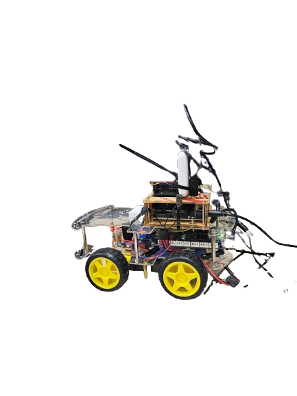
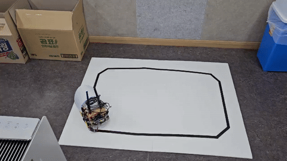

# Project_V2X

## ~25.01.27
### Hardware Setting



## 25.01.28

### function
- w,a,s,d 키보드로 car 제어
- . 입력시 정지

### setting
- [code](https://github.com/opmaksim/Project_V2X/tree/feature/ros_car/src/25.01.28_control_car_by_keyboard)
 1. 📂project_ros : jetsonNano ~/catkin_ws/src 에 붙여넣기
 2. 📂project_ros_arduino : Arduino IDE를 사용하여 OpenCR에 업로드
 3. ```bash
    #ROS host 시작
    roscore
 4. ```bash
    #Jetson과 OpenCr serial 통신
    rosrun rosserial_python serial_node.py __name:=arduino _port:=/dev/ttyACM0 _baud:=57600
 5. ```bash
    #publisher 실행
    rosrun project_ros project_ros

### challenge
- spd 변수 공유로인한 불편함 해결
- serial 통신 문제 원인 찾아야함 ( 전력 or wifi 문제 )

## 25.01.31

### function
- line follow </br>



### setting
- [code](https://github.com/opmaksim/Project_V2X/tree/feature/ros_car/src/25.01.30_one_line_follow_car)
- OpenCR 보드엔 01.28 코드 그대로 업로드
- requirement.txt 설치 후 코드 실행

### challenge
- 가끔 opencr이 동작 안하는 문제 (바퀴를 손으로 돌려주다보면 갑자기 동작함 왜 이런지는 모르겠음)
- 두개의 라인을 따라가도록 변경 ( 실제 도로와 유사환경 )

## 25.02.03

### function
- line follow model</br>


### setting
- [code](https://github.com/opmaksim/Project_V2X/tree/feature/lane_model)
- test_solid_dashe.py 코드에 카메라 화면 출력 코드추가하여 실행
- [젯슨나노](https://qengineering.eu/install-pytorch-on-jetson-nano.html) 환경에 동작하는 pytorch와 torchvision 은 해당 사이트 참조하여 설치

### challenge
- 라인이 깜빡거리며 완벽한 인식을 못하는 문제 해결
- dash 선은 끊겨있는데 어떤식으로 계산하여 도로의 중앙값을 추출해낼지 고민필요
